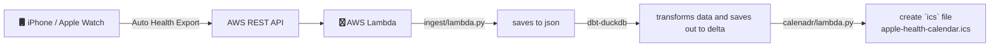
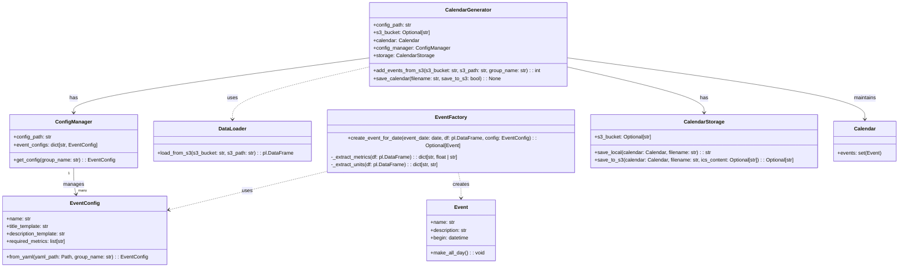

## Apple Health Calendar

### Github Actions

A serverless framework that automates the conversion of past daily statistics from Apple Watch into a calendar event.

### Detailed Process

1. A lambda function URL endpoint invokes the `ingest/lambda.py` handler function  to save the Apple Health export as is within the defined `S3` bucket.
2. `dbt` alongside `duckdb` is used to transform and unnest this data to the format required for displaying information
3. `calendar/lambda.py` creates an `ics` calendar file from the output `S3` buckets. You can subscribe to this `ics` calendar to integrate with any existing Calendar service.

## Entity Relationship Diagram

## Project Goals

- Automate exports from iPhone (via [AutoExport](https://github.com/Lybron/health-auto-export))
- Trigger workflow automatically when AutoExport uploads into S3 endpoint.
- Create `read-only` data available in AWS S3 bucket.
- Files are refreshed in S3 bucket that personal calendar is subscribed to.

## Getting Started

This project uses `uv` to manage environment and package dependencies

1. Setup project dependencies using `make setup`
2. Update `conf.py` to the location of the required `s3` buckets
3. Run `make deploy` to deploy the terraform stack and collect the API endpoint to be used within the iOS app

4. Trigger API export from `health-auto-export` using the API endpoint.

### Advanced

You can update the emojis and definitions by looking at the [`calendar/event_formats.yaml`](calendar/event_formats.yaml) file.

### Inspiration

- Work done by [`cleverdevil/healthlake`](https://github.com/cleverdevil/healthlake).
