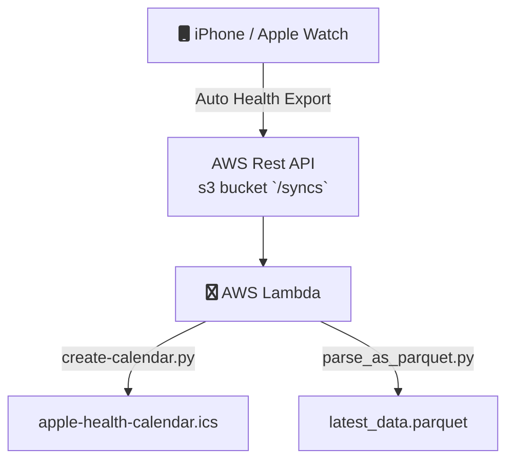

## Apple Health Calendar
A serverless framework that automates the conversion of past daily statistics from Apple Watch into a calendar event.

## Project Goals:
- Automate exports from iPhone
- Trigger workflow automatically when AutoExport uploads into S3 endpoint.
- Files are refreshed in S3 bucket that personal Google Calendar is subscribed to.