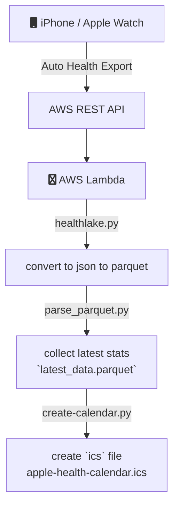

## Apple Health Calendar
A serverless framework that automates the conversion of past daily statistics from Apple Watch into a calendar event.




### 
```mermaid
classDiagram
direction LR
class outputs/health { 
    date
    source
    qty
    name
    units
    date_updated
}

```
## Project Goals:
- Automate exports from iPhone (via [AutoExport](https://github.com/Lybron/health-auto-export))
- Trigger workflow automatically when AutoExport uploads into S3 endpoint.
- Create `read-only` data available in AWS S3 bucket.
- Files are refreshed in S3 bucket that personal calendar is subscribed to.

## Getting Started 
This project uses `poetry` to manage environment and package dependencies 
```
# create virtual envs
poetry shell 
poetry install 

# install serverless plugin
sls plugin install -n serverless-wsgi 
sls plugin install -n serverless-python-requirements

```


* Inspired by work done by [`cleverdevil/healthlake`](https://github.com/cleverdevil/healthlake).