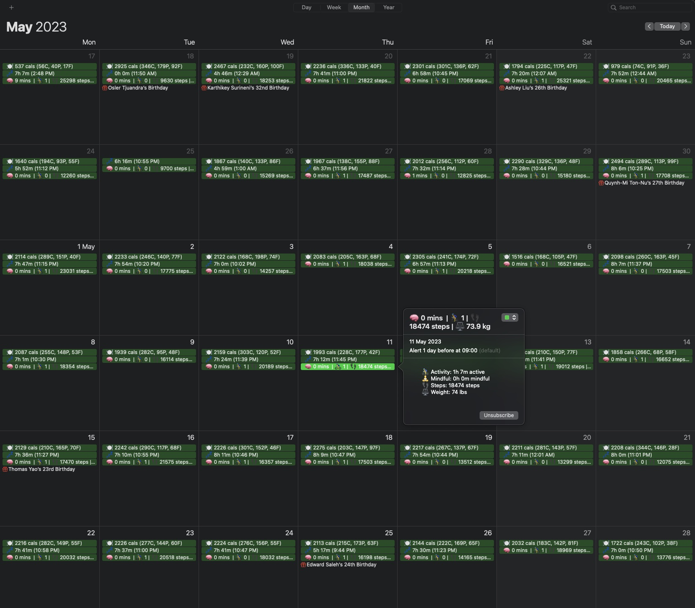
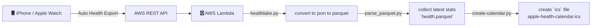
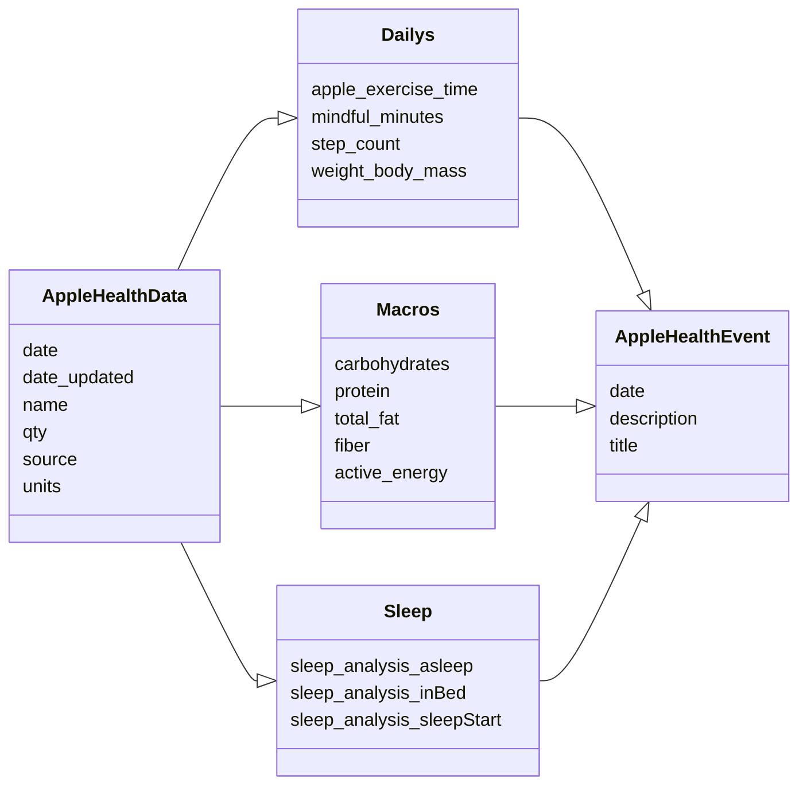
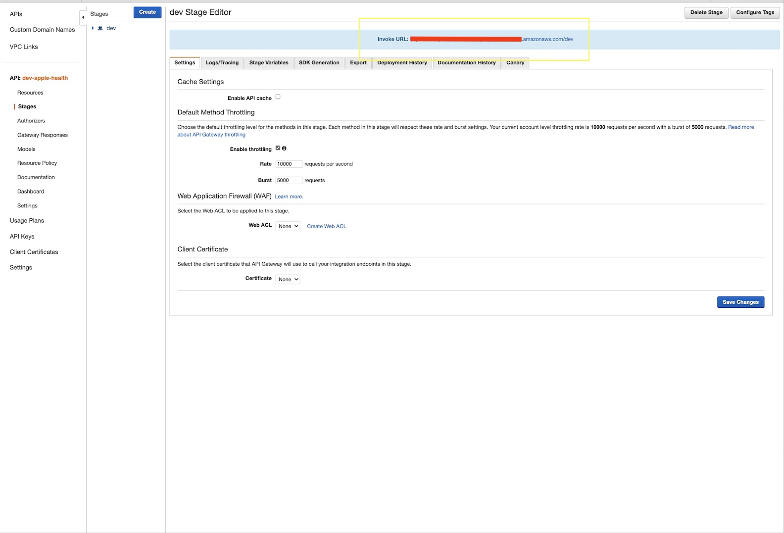

## Apple Health Calendar


A serverless framework that automates the conversion of past daily statistics from Apple Watch into a calendar event.



### Detailed Process
1. `/syncs` endpoint invokes the `healthlake.py` script to save the Apple Health export into the `AppleHealthData` table schema as a parquet file.  
2. `parse_parquet.py` then dedupes all parquet files and groups each metric by their latest unload date (saved as `health.parquet`)
3. `create_calendar.py` creates an `ics` calendar file with `health.parquet`. You can subscribe to this `ics` calendar to integrate with any existing Calendar service. 


## Entity Relationship Diagram


## Project Goals:
- Automate exports from iPhone (via [AutoExport](https://github.com/Lybron/health-auto-export))
- Trigger workflow automatically when AutoExport uploads into S3 endpoint.
- Create `read-only` data available in AWS S3 bucket.
- Files are refreshed in S3 bucket that personal calendar is subscribed to.

## Getting Started 
This project uses `poetry` to manage environment and package dependencies 
1. Setup project dependencies using `make setup`
```
# create virtual envs
poetry shell 
poetry install 

# install serverless plugin
sls plugin install -n serverless-wsgi 
sls plugin install -n serverless-python-requirements
```
2. Update `conf.py` to the location of the required s3 buckets 
3. Run `sls deploy` to deploy the Cloudformation stack and collect the API endpoint found here.


**Use the `Invoke URL` within AWS API Gateway**

4. Trigger API export from `health-auto-export` using the API endpoint - remember to include the `/syncs` suffix to the endpoint because that's where the `serverless` will trigger the processes.


### Advanced
You can update the emojis and definitiosn by looking at the `config/column.mapping.yaml` file. 

### Inspiration

* Work done by [`cleverdevil/healthlake`](https://github.com/cleverdevil/healthlake).