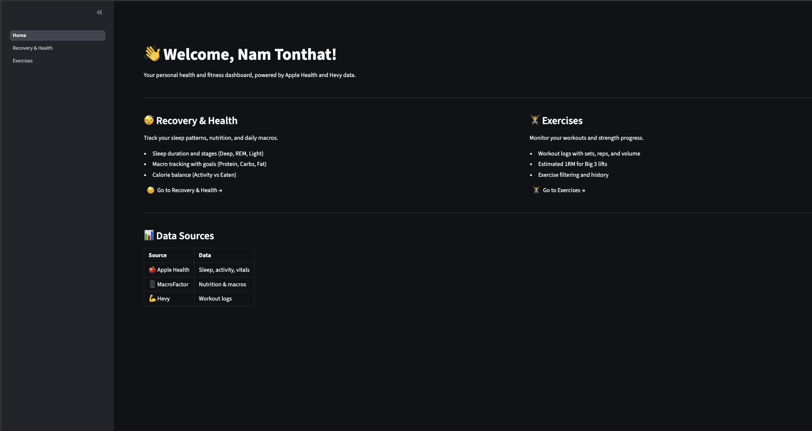
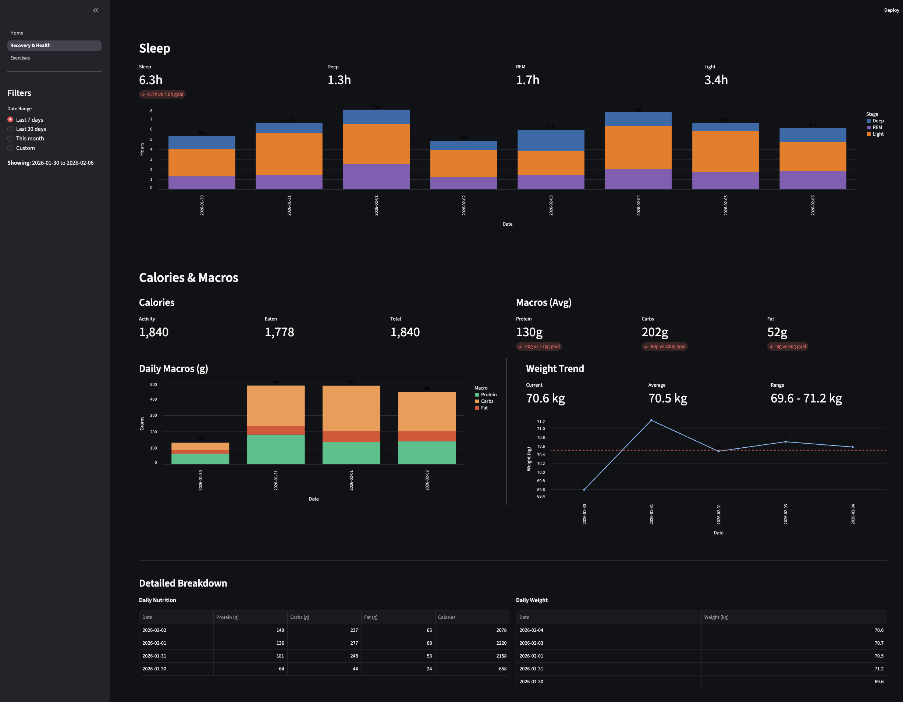
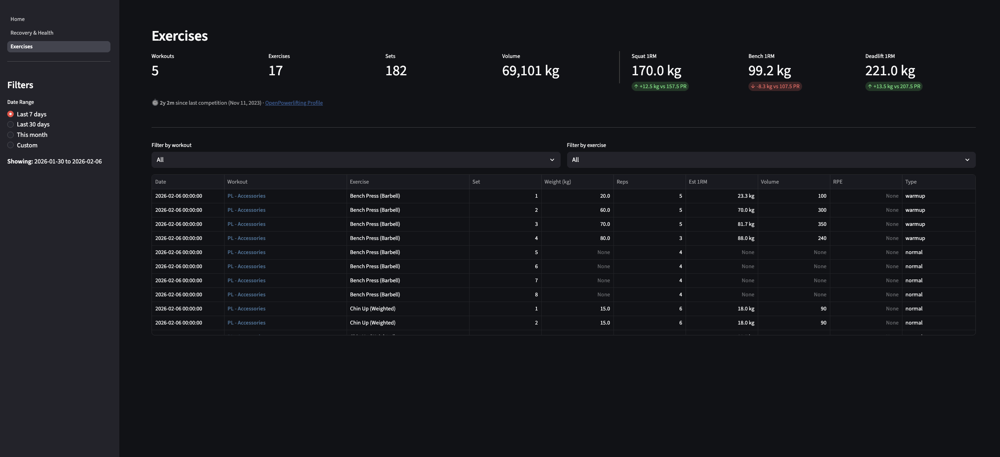

# Apple Health Data Dashboard

[](https://python.org)
[](https://streamlit.io)
[](https://getdbt.com)
[](https://duckdb.org)
[](https://dlthub.com)
[](https://aws.amazon.com/s3/)
[](https://pola.rs)
[](https://altair-viz.github.io)

A personal health and fitness dashboard that aggregates data from Apple Health, Hevy, and OpenPowerlifting into a unified Streamlit interface.

## Screenshots

### Home


### Recovery & Health


### Exercises


## Features

- **Sleep Tracking** - Duration and stages (Deep, REM, Light) with goal tracking
- **Nutrition** - Macros (Protein, Carbs, Fat) and calories from any app that syncs to Apple Health
- **Weight Trends** - Daily weight with average line
- **Workouts** - Exercise logs, volume, and estimated 1RM
- **Powerlifting PRs** - Competition history from OpenPowerlifting with comparison to current training

## Architecture

```
┌─────────────────┐     ┌─────────────────┐     ┌─────────────────┐
│  Apple Health   │     │  Nutrition App  │     │      Hevy       │
│    (Export)     │     │  (via Apple)    │     │      (API)      │
└────────┬────────┘     └────────┬────────┘     └────────┬────────┘
         │                       │                       │
         └───────────────────────┼───────────────────────┘
                                 │
                                 ▼
                    ┌────────────────────────┐
                    │    dlt Pipelines       │
                    │  (Extract & Load)      │
                    └───────────┬────────────┘
                                │
                                ▼
                    ┌────────────────────────┐
                    │      S3 Bucket         │
                    │  (landing/ & raw/)     │
                    └───────────┬────────────┘
                                │
                                ▼
                    ┌────────────────────────┐
                    │    dbt Models          │
                    │ (staging/intermediate/ │
                    │       marts/)          │
                    └───────────┬────────────┘
                                │
                                ▼
                    ┌────────────────────────┐
                    │   S3 (transformed/)    │
                    └───────────┬────────────┘
                                │
                                ▼
                    ┌────────────────────────┐
                    │  Streamlit Dashboard   │
                    └────────────────────────┘
```

## Data Sources

| Source | Data | Method |
|--------|------|--------|
| Apple Health | Sleep, Activity, Vitals | [Health Auto Export](https://www.healthyapps.dev/) to S3 |
| Nutrition App* | Nutrition & Macros | Syncs to Apple Health |
| Hevy | Workout logs | API |
| OpenPowerlifting | Competition PRs | Web scrape |

*Any app that logs nutrition data and syncs to Apple Health (e.g., MacroFactor, MyFitnessPal, Cronometer, Lose It!)

## Setup

### Prerequisites

- Python 3.11+
- [uv](https://github.com/astral-sh/uv) package manager
- AWS account with S3 bucket

### Installation

```bash
git clone https://github.com/namtonthat/apple-health-data.git
cd apple-health-data
uv sync
cp .env.example .env
```

### Configuration

Edit `.env` with your credentials:

```bash
# AWS
AWS_ACCESS_KEY_ID=your_key
AWS_SECRET_ACCESS_KEY=your_secret
S3_BUCKET_NAME=your_bucket

# Hevy API
HEVY_AUTH_TOKEN=your_token

# OpenPowerlifting
OPENPOWERLIFTING_URL=https://www.openpowerlifting.org/u/yourname

# User
USER_NAME="Your Name"

# Goals
GOAL_SLEEP_HOURS=7.0
GOAL_PROTEIN_G=170.0
GOAL_CARBS_G=300.0
GOAL_FAT_G=60.0
```

## Usage

### Run Pipelines

```bash
# Extract data
uv run python -m src.pipelines.hevy
uv run python -m src.pipelines.health
uv run python -m src.pipelines.openpowerlifting

# Transform with dbt
cd dbt_project && uv run dbt run
```

### Run Dashboard

```bash
uv run streamlit run src/dashboard/Home.py
```

## Automated Refresh

A GitHub Actions workflow runs every second day at midnight Melbourne time:

`.github/workflows/refresh-data.yml`

Required GitHub secrets:
- `AWS_ACCESS_KEY_ID`
- `AWS_SECRET_ACCESS_KEY`
- `S3_BUCKET_NAME`
- `HEVY_AUTH_TOKEN`
- `OPENPOWERLIFTING_URL`

## Project Structure

```
apple-health-data/
├── .github/workflows/     # GitHub Actions
├── dbt_project/           # dbt models
│   └── models/
│       ├── staging/       # Source cleaning
│       ├── intermediate/  # Business logic
│       └── marts/         # Final tables
├── src/
│   ├── dashboard/         # Streamlit app
│   │   ├── Home.py
│   │   └── pages/
│   └── pipelines/         # dlt extract pipelines
├── docs/screenshots/      # Dashboard screenshots
└── pyproject.toml
```

