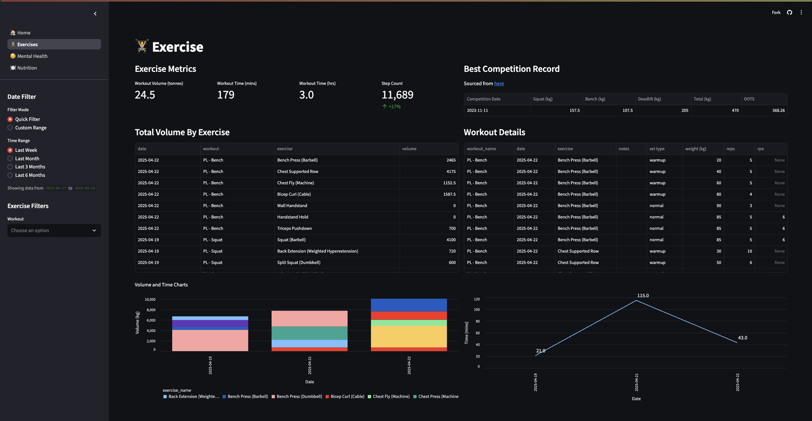

## 📱 apple-health-data

Built with 

#### 🚀 Github Actions

## Purpose

A serverless framework that automates the conversion of past daily statistics from Apple iOS into a calendar event.

## 🎯 Project Goals

- Automate exports from iPhone (via [AutoExport](https://github.com/Lybron/health-auto-export))
- Trigger workflow automatically when AutoExport uploads into S3 endpoint.
- Create `read-only` data available in AWS S3 bucket.
- Files are refreshed in S3 bucket that personal calendar is subscribed to.
- Details about the process and entity relationship diagram are provided in the [README](https://github.com/namtonthat/apple-health-calendar/blob/main/docs/README.md)

> [!important]
> With the `sleep` data, it ignores intra sleep stats

## Screenshots

### 📅 Calendar

Overview of the health data as `calendar` events

### 📄 Dashboard

A dashboard was also created with `streamlit` and hosted on [`namtonthat.streamlit.app`](https://namtonthat.streamlit.app)

### 🆕 Getting Started

This project uses `uv` to manage environment and package dependencies

1. Setup project dependencies using `make setup`
2. Create a `.env` (based off the [`.env.example`](.env.example)) to define the specific infra requirements
3. Run `make infra` to deploy the terraform stack and collect the API endpoint to be used within the iOS app
4. Trigger API export from `health-auto-export` using the API endpoint.

  
   
  <em>Auto Export - iOS Version</em>

#### ⚙️ Advanced

You can update the emojis and definitions by looking at the [`calendar/event_formats.yaml`](https://github.com/namtonthat/apple-health-calendar/blob/main/calendar/events_formats.yaml) file.

#### 💡 Inspiration

- Work done by [`cleverdevil/healthlake`](https://github.com/cleverdevil/healthlake).
